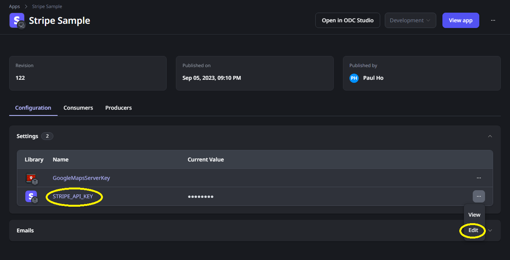

# ODC Stripe Connector

## Introduction
OutSystems Developer Cloud (ODC) is a cloud-native app development platform that provides a modular, scalable environment in which you develop and deploy your apps. With ODC you can build and deploy enterprise-grade, mission-critical apps in weeks. You can build web apps, web portals, mobile apps, and business workflows faster than with traditional development tools. You can then deploy your apps in a scalable, secure, and high-performance environment.

This connector has two parts:

1. A custom code extension : Stripe_Ext
2. A library that uses the underlying custom code extension: Stripe Connector (Black Belt Edition)

The connector provides the following functionality (as of now):
1. CreateCheckoutSession
2. CreateCustomer
3. CreatePaymentIntent
4. CreateRefund
5. CreateSubscription
6. GetCharges
7. RetrieveSubscriptionsWithDetails
8. RetrieveSubscriptionDetails
9. RetrieveSubscription
10. SearchCustomer
11. UpdateCustomer

There is also a operational support API to discover the unique build number for this connector so that any bugs discovered can be reported against this unique build number. The API is

1. GetBuildInfo

## Pre-requisites

To use this component correctly, you should have a [Stripe account](https://stripe.com/docs/payments/account/activate) setup and you should have created the needed [API key via Developer dashboard](https://stripe.com/docs/keys). Note that the secret key is the one to be used in the ODC Stripe Connector library configuration. For now, please take note of the value of the secret key found in your Stripe Developer dashboard. 

Without the correct API key, you will not be able to connect to Stripe publicly exposed service. This API key uniquely identify you to that service.

## Installation
You can install the connector through [ODC Forge](https://success.outsystems.com/documentation/outsystems_developer_cloud/forge/install_or_update_a_forge_asset/#install-a-forge-asset).

You should install both the custom code extension as well as the Stripe Connector (Black Belt Edition) library. 

## How to Use
### Add library to your application
Firstly, add the _Stripe Connector (Black Belt Edition)_ library to your application as shown below.

 

Depending whether you want to use all the APIs, you can selectively add the needed APIs (or removed unused ones automatically later).

### Configuration
The _Stripe Connector (Black Belt Edition)_ library requires a setting STRIPE_API_KEY to be configured. As your application uses this library, the value of STRIPE_API_KEY can be configured in ODC portal as a [secret](https://success.outsystems.com/documentation/outsystems_developer_cloud/building_apps/set_as_secret/). Refer to the screenshot below as an example of where to find the STRIPE_API_KEY for your application

 

### Example 1: Creating a checkout session

A Checkout Session represents your customer's session as they pay for one-time purchases or subscriptions through Checkout or Payment Links. We recommend creating a new Session each time your customer attempts to pay.

Once payment is successful, the Checkout Session will contain a reference to the Customer, and either the successful PaymentIntent or an active Subscription.

You can create a Checkout Session on your server and redirect to its URL to begin Checkout.

NOTE: The customer ID is an optional field. However, it is recommended to supply it.

### Example 2: Creating payment intent

A PaymentIntent guides you through the process of collecting a payment from your customer. It is recommended that you create exactly one PaymentIntent for each order or customer session in your system. You can reference the PaymentIntent later to see the history of payment attempts for a particular session.

You can create a Payment Intent for a customer as shown in the sample flow below.

## Found a bug?

Kindly submit your bug report [here](https://github.com/PaulHoOutsystems/stripe_odc_connector/issues) and do indicate the build number of the library which you are using too.

## Contact

You can reach out to me via email at paul.ho@outsystems.com 